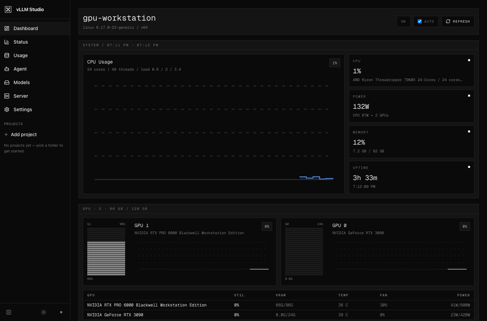
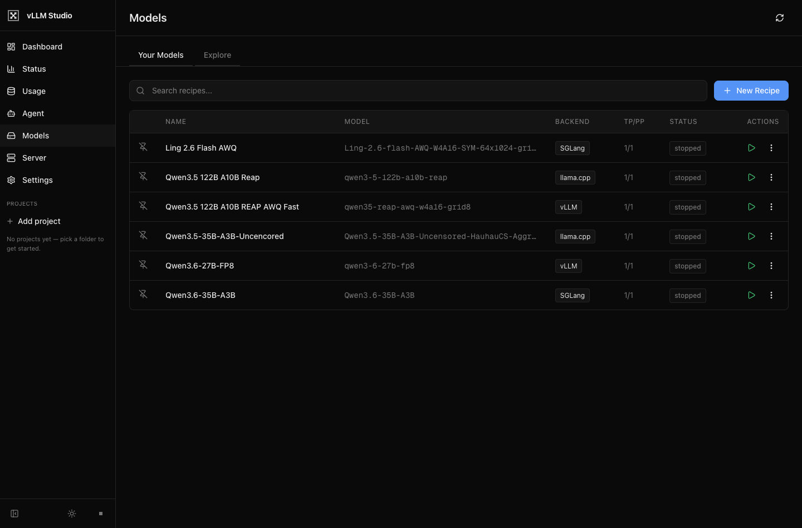
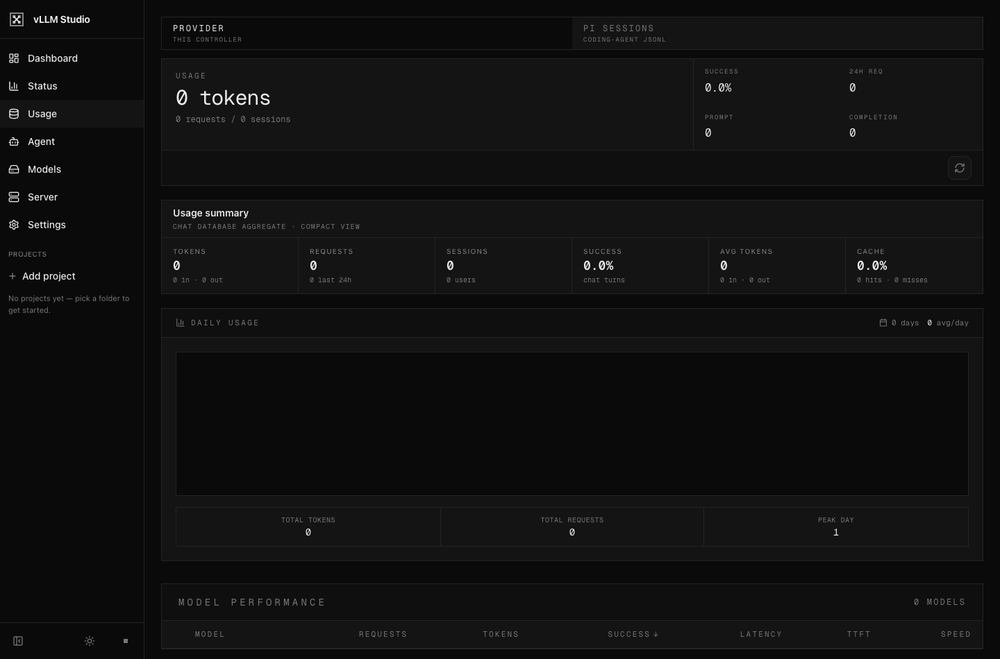

<p align="center">
  
</p>

<h1 align="center">vLLM Studio</h1>

<p align="center">
  A local-first control room for serving, testing, and operating open models on your own GPU workstation.
</p>

<p align="center">
  <a href="https://github.com/net-snix/vllm-studio/releases"></a>
  <a href="LICENSE"></a>
  
  
  
</p>

<p align="center">
  
</p>

## What it does

vLLM Studio brings model recipes, runtime launches, agent sessions, usage stats,
and Linux host telemetry into one browser UI. It is designed for setups where
the controller and frontend run on the same GPU machine, while the browser can
connect from anywhere on a trusted private network.

- Launch and stop recipes for vLLM, SGLang, llama.cpp, and other local backends.
- Track GPU, CPU, memory, disk, service, container, fan, and thermal telemetry.
- Run browser-based agent sessions with project-scoped history and Pi session replay.
- Inspect usage by provider traffic or coding-agent JSONL sessions.
- Keep the model server private while exposing only the frontend you choose.

## Screenshots

### Model Recipes



### Usage Analytics



## Architecture

```text
Browser / desktop app
        |
        v
Next.js frontend  ->  Bun controller  ->  model backends
        |                    |              vLLM / SGLang / llama.cpp
        |                    |
        +--------------------+-> Linux host telemetry
```

The recommended deployment is intentionally simple:

- `controller/`: Bun backend for recipes, launches, proxying, metrics, usage, and telemetry.
- `frontend/`: Next.js UI for dashboard, models, agent sessions, settings, and usage.
- `cli/`: command-line access to controller workflows.
- `docs/`: operator notes for Linux dashboard and runtime behavior.
- `scripts/`: release, deployment, and validation helpers.

## Quick Start

Install dependencies and run the two services:

```bash
cd controller
bun install
bun src/main.ts
```

```bash
cd frontend
npm install
npm run dev
```

Then open:

```text
http://localhost:3000
```

For production-style local serving, build the frontend and run the standalone
server:

```bash
cd frontend
npm run build
npm run start
```

## Health Checks

```bash
curl -sS http://localhost:8080/health
curl -I http://localhost:3000
```

## Useful Commands

```bash
# frontend
cd frontend
npm run lint
npm test
npm run build

# controller
cd controller
bun run typecheck
bun test
```

## Configuration

Core runtime configuration is environment-driven. Common values:

- `VLLM_STUDIO_HOST`: controller bind host.
- `VLLM_STUDIO_PORT`: controller port.
- `VLLM_STUDIO_API_KEY`: optional API key for private deployments.
- `VLLM_STUDIO_MODELS_DIR`: model storage root.
- `VLLM_STUDIO_DASHBOARD_DISKS`: comma-separated disk labels for dashboard cards.

See [Linux Dashboard](docs/linux-dashboard.md) for the telemetry endpoint and
operator view.

## Release Flow

Releases are tag and GitHub-release based. The semantic-release config creates
GitHub releases from conventional commits on `main`; manual releases should
target the exact commit being shipped and keep public notes free of local host
names, private paths, and private network details.
